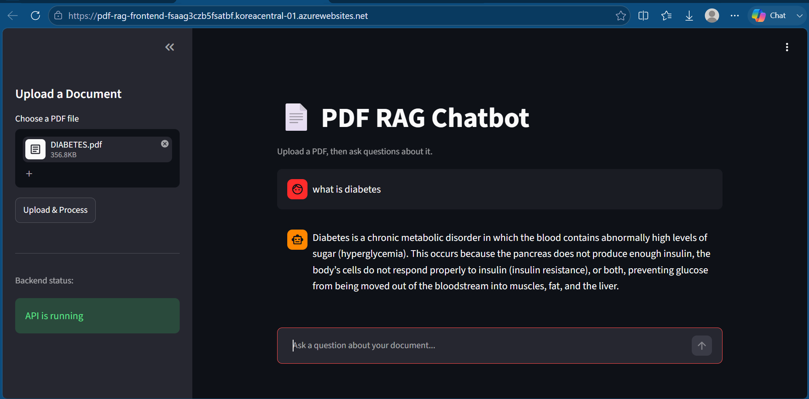

# 📄 PDF RAG Chatbot — Azure AI Stack

A full-stack **Retrieval-Augmented Generation (RAG)** chatbot that lets users upload PDF documents and ask natural-language questions about their content — built end-to-end on **Microsoft Azure's AI and cloud infrastructure**, from document ingestion to a deployed, internet-accessible web app.

🔗 **Live Demo:** [pdf-rag-frontend-fsaag3czb5fsatbf.koreacentral-01.azurewebsites.net](https://pdf-rag-frontend-fsaag3czb5fsatbf.koreacentral-01.azurewebsites.net)

🔗 **Backend API Docs (Swagger):** [ragbotwebapp-hff7hpczb6a5fjha.koreacentral-01.azurewebsites.net/docs](https://ragbotwebapp-hff7hpczb6a5fjha.koreacentral-01.azurewebsites.net/docs)

---

## 🖼️ Preview



---

## 🚀 What It Does

1. **Upload** a PDF through the chat interface
2. The document is stored in **Azure Blob Storage** and processed using **Azure Document Intelligence** for accurate text extraction (handles layout, tables, and scanned pages — not just plain text)
3. Extracted text is chunked and converted into vector embeddings using **Azure OpenAI's `text-embedding-ada-002`**
4. Embeddings are indexed in **Azure AI Search** for fast semantic (vector) retrieval
5. When a question is asked, the most relevant chunks are retrieved and passed as context to an Azure-hosted LLM (**`gpt-oss-120b`**, served via Azure AI Foundry), which generates a grounded, context-aware answer
6. The entire app — backend and frontend — runs live on **Azure App Service**

---

## 🏗️ Architecture

```
 ┌────────────┐        ┌──────────────┐        ┌────────────────────┐
 │  Streamlit │  HTTP  │   FastAPI    │        │  Azure Blob Storage │
 │  Frontend  ├───────►│   Backend    ├───────►│  (PDF originals)   │
 │ (App Svc)  │        │  (App Svc)   │        └────────────────────┘
 └────────────┘        └──────┬───────┘
                               │
                               ▼
                    ┌─────────────────────┐
                    │ Document Intelligence│  (text extraction)
                    └──────────┬──────────┘
                               ▼
                    ┌─────────────────────┐
                    │  Azure OpenAI        │  (ada-002 embeddings)
                    └──────────┬──────────┘
                               ▼
                    ┌─────────────────────┐
                    │  Azure AI Search      │  (vector index)
                    └──────────┬──────────┘
                               ▼
                    ┌─────────────────────┐
                    │  Azure AI Foundry     │  (gpt-oss-120b — answer generation)
                    └─────────────────────┘
```

---

## 🛠️ Tech Stack

| Layer                  | Technology                                         |
|-------------------------|----------------------------------------------------|
| Frontend                | Streamlit                                          |
| Backend / API           | FastAPI                                            |
| Embeddings              | Azure OpenAI — `text-embedding-ada-002`            |
| Chat / LLM              | Azure AI Foundry — `gpt-oss-120b`                  |
| Vector Search           | Azure AI Search                                    |
| Document Processing     | Azure Document Intelligence (`prebuilt-read`)      |
| File Storage            | Azure Blob Storage                                 |
| Hosting / Deployment    | Azure App Service (Linux, Python 3.12)             |
| CI/CD                   | GitHub Actions (auto-deploy on push to `main`)     |

---

## 📂 Project Structure

```
.
├── main.py              # FastAPI backend — /upload and /ask endpoints
├── app.py               # Streamlit frontend — chat UI + file uploader
├── ingest_v2.py          # Standalone CLI ingestion script (Blob + Doc Intelligence)
├── create_index.py       # One-time script to create the Azure AI Search index
├── requirements.txt      # Python dependencies
├── .env.example           # Template for required environment variables
└── README.md
```

## ☁️ Deployment

Both the FastAPI backend and Streamlit frontend are deployed as separate **Azure App Service** instances (Linux, Python 3.12), connected to this GitHub repository via **GitHub Actions** for continuous deployment on every push to `main`.

- **Backend startup command:** `uvicorn main:app --host 0.0.0.0 --port 8000`
- **Frontend startup command:** `python -m streamlit run app.py --server.port 8000 --server.address 0.0.0.0`

---

## 📌 Key Highlights

- Fully **cloud-native RAG pipeline** — no local-only dependencies, every step (storage, extraction, embedding, search, generation) runs on Azure
- **Production-style separation** of backend (API) and frontend (UI), each independently deployed and scalable
- **Document Intelligence** integration for robust PDF parsing beyond plain text extraction
- **Rate-limit-aware** query logic with automatic retry/backoff for production resilience
- Live, publicly accessible deployment — not just a local demo

---

## 👤 Author

**Atin Choudhary**
B.Tech Information Technology, Global Institute of Technology, Jaipur
[GitHub](https://github.com/AtinChoudhary06) • atin06choudhary@gmail.com
